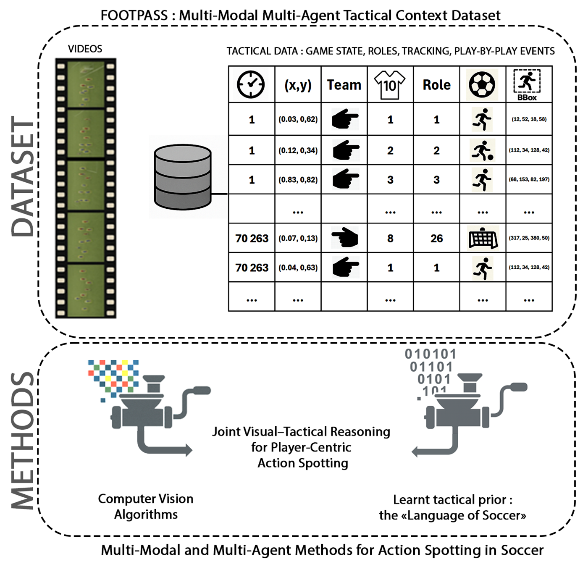

# FOOTPASS: Footovision Play-by-Play Action Spotting in Soccer Dataset  
### _Baselines for the SoccerNet Player-Centric Ball-Action Spotting Challenge 2026_

---



---

## 🏟️ Overview

**FOOTPASS** (Footovision Play-by-Play Action Spotting in Soccer) introduces the **first player-centric, multi-modal, multi-agent dataset** designed for *play-by-play* action spotting in full-length soccer broadcast videos.

This benchmark supports the **SoccerNet 2026 Player-Centric Ball-Action Spotting Challenge**, aiming to identify **who performs what and when** in real broadcast footage.

---

## 🎯 Motivation

Why FOOTPASS?
Most public soccer datasets either (i) annotate sparse/global events with timestamps only—without telling you who performed the action—or (ii) provide tactical/per-player logs but without the original broadcast video. FOOTPASS closes this gap by aligning broadcast video with player-centric, ball-related actions and team/jersey/role information, plus tracking and spatiotemporal data. The result is a benchmark purposely designed to foster joint research in visual reasoning and tactical understanding under realistic match conditions.

It integrates:
- Full HD broadcast **videos** (25 fps)
- **Spatiotemporal data** (positions, velocities)
- **Tracking data** (tracklets: sequences of bounding boxes)
- **Team, Jersey numbers and Role information**
- **Play-by-play events** with frame-level anchors: sequence of (frame, team, jersey, class)

---

## 📦 Dataset Structure

FOOTPASS contains **54 complete matches** from top European competitions (2023–24):  
Ligue 1, Bundesliga, Serie A, La Liga, and UEFA Champions League — representing 50 teams.

| Split | Matches | Events |
|:------|:--------:|-------:|
| Train | 48 | 91 327 |
| Validation | 3 | 6 070 |
| Challenge/Test | 3 | 5 595 |

Each event is represented as: (frame, team, jersey, class)

where  
- `frame` = frame index (0-based)  
- `team` = 0 (left) / 1 (right)  
- `jersey` = player shirt number  
- `class` = action category  

---

## 📊 Dataset Statistics

- **102 992 annotated events**
- **81.5 %** have visible bounding boxes  
- **Class imbalance** mirrors real play: Pass (49.9 %), Drive (39.0 %), others ≈ 11 %
- **13 player roles** defined (Goalkeeper → Right Back)

---

## ⚽ Action Classes

| Class | Description |
|:------|:-------------|
| **Drive** | Player carries the ball after reception |
| **Pass** | Ball strike toward a teammate |
| **Cross** | Pass from wide area toward penalty area |
| **Shot** | Attempt on goal |
| **Header** | Intentional ball contact with head |
| **Throw-in** | Restart from sideline |
| **Tackle** | Legal dispossession |
| **Block** | Interception of opponent’s shot or pass |

These instantaneous events (one frame per action) form the *play-by-play* record of a match.

---

## 🧩 Player Roles

Each player in FOOTPASS is associated with one of 13 predefined **tactical roles**, determined from formations, trajectories, and expert annotation.  
These roles help integrate **multi-agent reasoning** and **tactical structure** into action spotting models.

| Role ID | Tactical Role |
|:--------:|:--------------|
| **1** | Goalkeeper |
| **2** | Left Back |
| **3** | Left Central Back |
| **4** | Mid Central Back |
| **5** | Right Central Back |
| **6** | Left Midfielder |
| **7** | Right Midfielder |
| **8** | Defensive Midfielder |
| **9** | Attacking Midfielder |
| **10** | Left Winger |
| **11** | Right Winger |
| **12** | Central Forward |
| **13** | Right Back |

---

## 🧠 Baseline Methods

This repository provides reference implementations:

| Baseline | Description |
|:----------|:-------------|
| **TAAD** | Track-Aware Action Detector (visual STAD baseline) |
| **TAAD + GNN** | Adds spatio-temporal graph reasoning (multi-agent context) |
| **TAAD + DST** | Denoising Sequence Transduction model with game-level reasoning |

All models output predictions of the form `(frame, team, jersey, class)`.

---

## 📈 Evaluation Protocol

Evaluation follows the official **SoccerNet 2026 Player-Centric Ball-Action Spotting Challenge**:

### 📁 Submission Format

Predictions must be submitted as **JSON files**, one per split (`train`, `val`, `challenge`).  
Each JSON file should follow the same structure as those in the repository under `playbyplay_PRED/`.

Example (simplified excerpt):
```json
{
  "keys": [
    "game_18_H1",
    "game_18_H2",
    ....,
    ....,
  ],
  "events": {
    "game_18_H1": [
      [
        39,
        0,
        81,
        2,
        0.8043681740760803
      ],
      [
        74,
        0,
        3,
        1,
        0.7428927898406982
      ],
      ....
      [
        142815,
        0,
        3,
        1,
        0.962439775466919
      ]
    ]
  }
}
```
👉 See the baseline example playbyplay_TAAD_val.json

---

📏 Metrics

Primary: F1 score @ confidence threshold τ = 15 %

Temporal tolerance: ± 12 frames

Evaluation: via SoccerNet evaluation server
(ground-truth for the challenge set remains hidden)

---

## 🔗 Access

| Resource | Location |
|:----------|:----------|
| **Dataset** | [Hugging Face – SoccerNet](https://huggingface.co/datasets/SoccerNet/SN-PCBAS-2026/tree/main)
| **Videos** | Available via **SoccerNet NDA** |
| **Evaluation** | TBD |
| **Paper** | [`FOOTPASS_preprint_September_2025.pdf`](./FOOTPASS_preprint_September_2025.pdf) |

---

## 🚀 Getting Started

# Clone the repository
git clone https://github.com/Footovision/FOOTPASS.git
cd FOOTPASS

---

## 📚 Citation

If the **FOOTPASS** dataset benefits your work, please kindly consider citing the paper:

```bibtex
@article{Ochin2025FOOTPASS,
  title   = {FOOTPASS: A Multi-Modal Multi-Agent Tactical Context Dataset for Play-by-Play Action Spotting in Soccer Broadcast Videos},
  author  = {Ochin, Jérémy and Chekroun, Raphael and Stanciulescu, Bogdan and Manitsaris, Sotiris},
  journal = {Submitted to CVIU},
  year    = {2025}
}
```
You may also be interested in the following related works:

```bibtex
@InProceedings{Singh2023,
  author    = {Singh, Gurkirt and Choutas, Vasileios and Saha, Suman and Yu, Fisher and Van Gool, Luc},
  title     = {Spatio-Temporal Action Detection Under Large Motion},
  booktitle = {Proceedings of the IEEE/CVF Winter Conference on Applications of Computer Vision (WACV)},
  month     = {January},
  year      = {2023},
  pages     = {6009--6018}
}

@InProceedings{Ochin2025GNN,
  author    = {Ochin, Jeremie and Devineau, Guillaume and Stanciulescu, Bogdan and Manitsaris, Sotiris},
  title     = {Game State and Spatio-Temporal Action Detection in Soccer Using Graph Neural Networks and 3D Convolutional Networks},
  booktitle = {Proceedings of the 14th International Conference on Pattern Recognition Applications and Methods (ICPRAM)},
  year      = {2025},
  pages     = {636--646},
  publisher = {SciTePress},
  organization = {INSTICC},
  doi       = {10.5220/0013161100003905},
  isbn      = {978-989-758-730-6}
}

@InProceedings{Ochin2025DST,
  author    = {Ochin, Jeremie and Chekroun, Raphael and Stanciulescu, Bogdan and Manitsaris, Sotiris},
  title     = {Beyond Pixels: Leveraging the Language of Soccer to Improve Spatio-Temporal Action Detection in Broadcast Videos},
  booktitle = {Proceedings of the 22nd International Conference on Advanced Concepts for Intelligent Vision Systems (ACIVS)},
  year      = {2025},
  note      = {Scheduled for publication by Springer on 24th November 2025}
}
```
---

📜 License

Dataset annotations & baselines released under CC BY-NC 4.0.

Redistribution of SoccerNet broadcast videos is prohibited under the NDA.

---

✉️ Contact

Jeremie Ochin · jeremie.ochin@minesparis.psl.eu
Footovision Research · www.footovision.com
